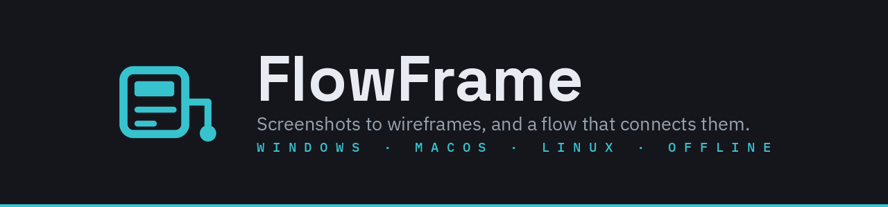
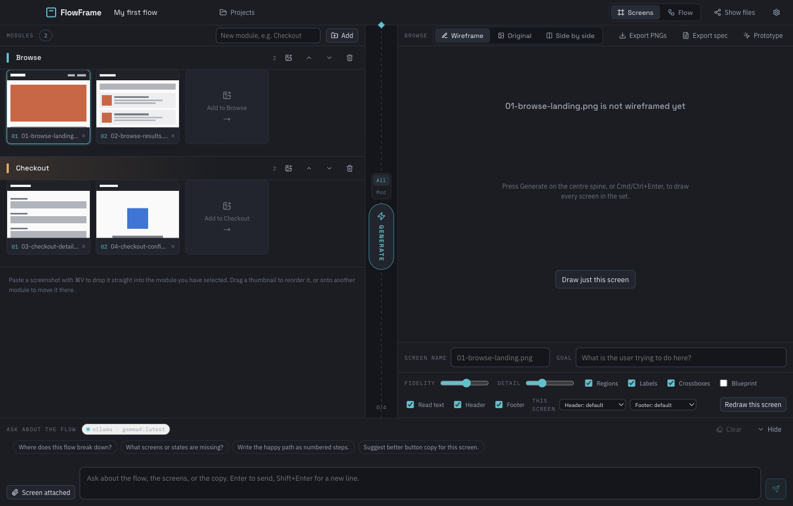
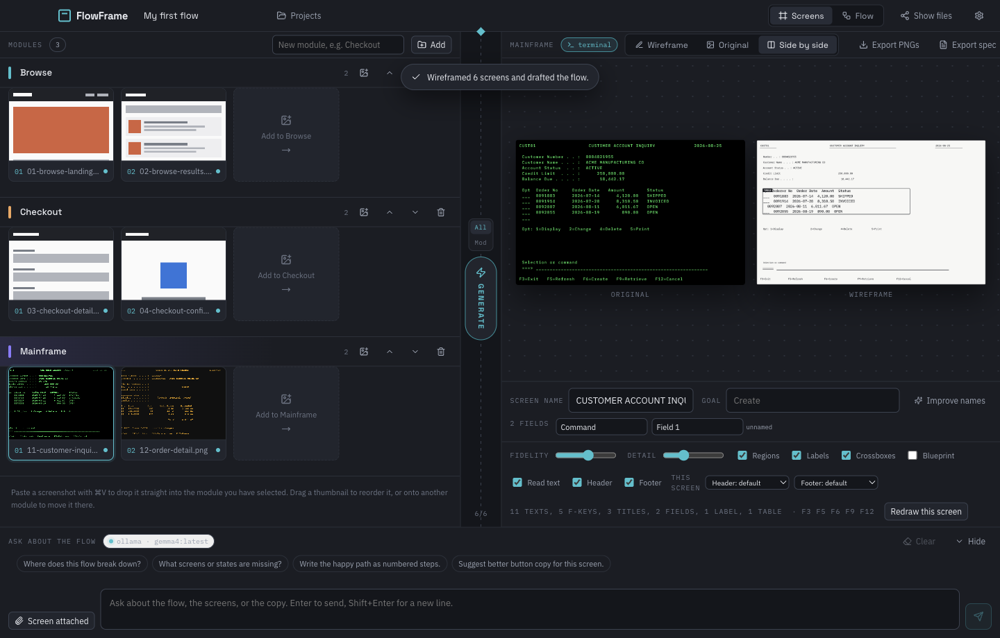
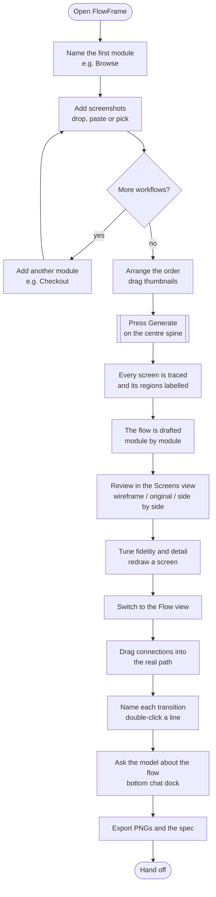
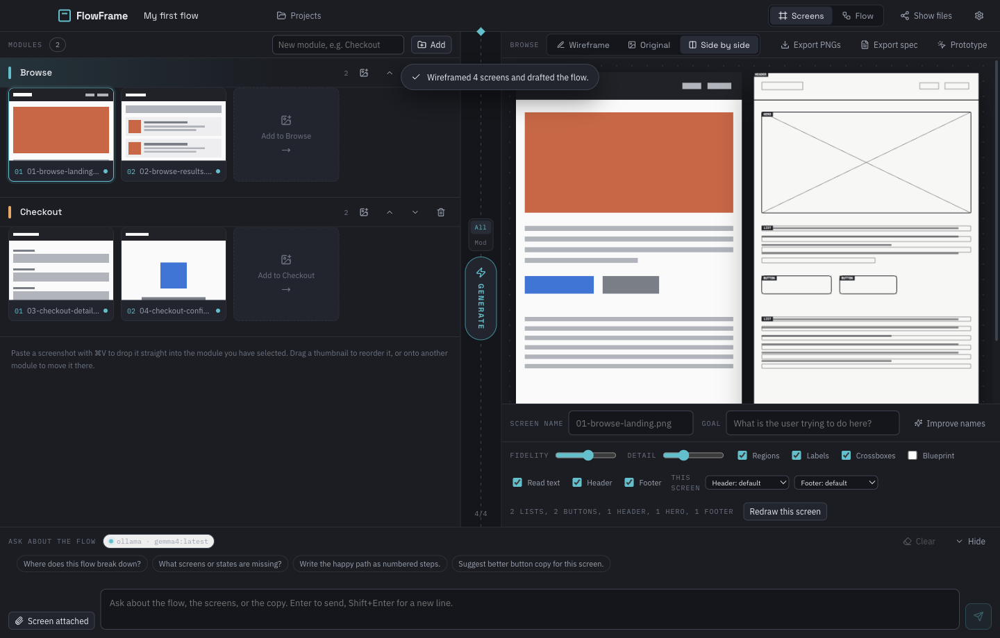
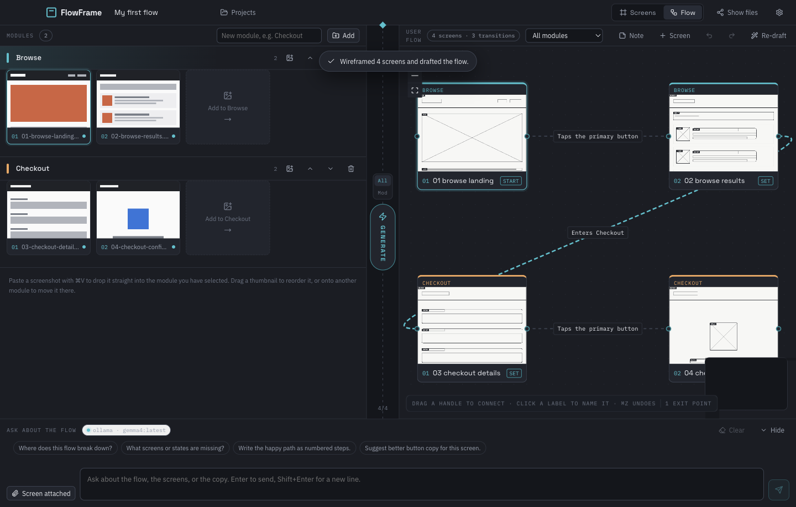
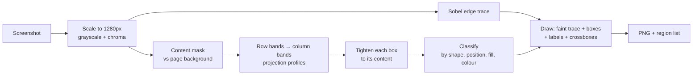
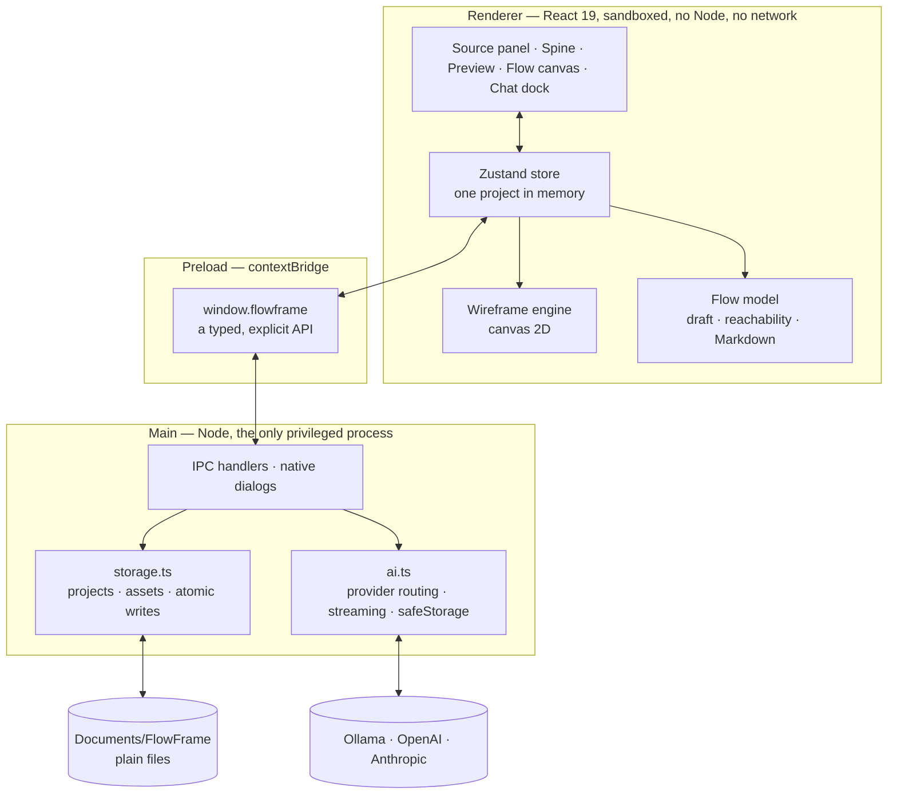
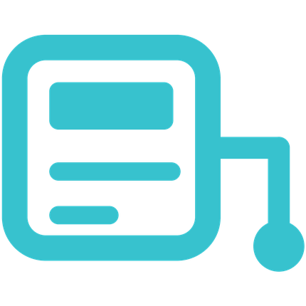

<div align="center">



**Turn a pile of screenshots into editable wireframes and a connected user flow — including IBM 3270 and AS/400 green screens. Grouped by module, stored on your own drive, and able to talk to a local model.**


[](https://www.linkedin.com/in/yarlagadda/)

No account, no upload, no server.

**Created by [Sireesh Yarlagadda](https://www.linkedin.com/in/yarlagadda/)**

</div>

---

## Contents

- [What it is](#what-it-is)
- [Why it exists](#why-it-exists)
- [Mainframe and terminal screens](#mainframe-and-terminal-screens)
- [Reading the words off a screen](#reading-the-words-off-a-screen)
- [Screen names, goals and fields](#screen-names-goals-and-fields)
- [Including or excluding the header and footer](#including-or-excluding-the-header-and-footer)
- [The clickable prototype](#the-clickable-prototype)
- [Install and run](#install-and-run)
- [The end-to-end user flow](#the-end-to-end-user-flow)
- [The interface, panel by panel](#the-interface-panel-by-panel)
- [Working with modules](#working-with-modules)
- [The chat: local and cloud models](#the-chat-local-and-cloud-models)
- [Where your data lives](#where-your-data-lives)
- [Exports](#exports)
- [Keyboard shortcuts](#keyboard-shortcuts)
- [How it works](#how-it-works)
- [Architecture](#architecture)
- [Deeper documentation](#deeper-documentation)
- [Testing](#testing)
- [Building installers](#building-installers)
- [Troubleshooting](#troubleshooting)
- [The mark](#the-mark)
- [Author](#author)
- [Credits and license](#credits-and-license)

---

## What it is

FlowFrame is a desktop app. You drop in the screenshots of a product — a competitor's app, an old
version of your own, a set of Figma exports, anything you can take a picture of — and it gives you
back two things:

1. **A clean wireframe of every screen.** Colour, imagery and copy are stripped away; what stays is
   the skeleton: header, hero, cards, lists, fields, buttons, footer, each one boxed and labelled.
2. **A user flow that connects them.** Each screen becomes a node, the transitions between them are
   drawn as labelled arrows, and you drag them into the path a real person would take.
3. **A named inventory of what is on each screen.** The screen's own title becomes its name, each
   entry field is paired with the label that names it, and every button becomes an action the flow
   can be built from. All of it editable, and your edits outlive every redraw.
4. **A clickable prototype.** One self-contained HTML file where every button is a hotspot that goes
   where your flow says it goes. Open it in any browser, hand it to anyone.

It also **reads the words off each screen** — field labels, button text, screen titles — and keeps
them with the wireframe, so the exported spec is readable without the images and a local model can
reason about what the screens actually say.

Both graphical screenshots and **IBM 3270 / AS/400 5250 terminal screens** are handled, each with
its own detection and segmentation.

Screens are grouped into **modules** — one module per workflow. Browse, Checkout, Onboarding,
Settings. Each module is designed on its own, and the modules hand off to each other so the whole
product still reads as one path.

<div align="center">
  
  <br /><em>Screens grouped into modules on the left, the Generate spine down the middle.</em>
</div>

---

## Why it exists

The gap this closes is the one between *"here are twelve screenshots"* and *"here is what we are
building"*.

- **Wireframing a reference app by hand takes hours.** Tracing boxes over a screenshot is mechanical
  work. FlowFrame does the tracing so you spend your time on the decisions.
- **Screens without a flow are just pictures.** A wireframe on its own does not tell you that the
  user can reach the confirmation screen but can never get back. The flow view does, and it names
  the dead ends and the unreachable screens for you.
- **Design reviews need a shared artefact.** The Markdown export is a hand-off document: a Mermaid
  diagram of the whole product, a Mermaid diagram per module, the numbered steps, what each screen
  contains, and an inventory table. It drops straight into a PR, a Notion page, or a ticket.
- **Screenshots are often confidential.** Product mockups, customer dashboards and internal tools
  are exactly the things you cannot upload to a web tool. FlowFrame never sends an image anywhere
  unless you explicitly ask a cloud model a question — and with Ollama selected, not even then.

**Who gets the most from it:** product designers reverse-engineering a reference app; PMs turning a
competitor teardown into a spec; engineers who need a flow diagram before they estimate; anyone
running a design review who needs the whole product on one canvas.

---

## Mainframe and terminal screens

Green screens are a first-class case, not an awkward kind of screenshot. FlowFrame recognises a
3270 or 5250 screen from its dark background, single phosphor hue and regular character grid, and
then reads it the way a terminal is actually laid out.

<div align="center">
  
  <br /><em>A CICS inquiry screen: the title, the labelled fields, the subfile kept as one table, and the PF keys.</em>
</div>

| What it finds | How |
| --- | --- |
| The screen name | The wordiest run on the top row, past the transaction id and the date |
| Field labels | Runs ending in `:` or a dot-leader trail |
| Entry fields | Runs of underscores, and `===>` command lines |
| Subfiles | Consecutive rows whose columns line up merge into one table |
| The message line | Runs starting with a message id such as `DFHCE3520` |
| PF keys | `F3=Exit`, `PF12=Cancel`, `press ENTER` — turned into the screen's actions |

Those PF keys are the point. A mainframe application's transitions *are* its function keys, so a
screen offering `F6=Create` produces the transition **"Presses F6 (Create)"** in the flow, rather
than a generic "Continues". Flow nodes are named after the screen's own title, so the canvas reads
`CUSTOMER ACCOUNT INQUIRY` instead of `11-customer-inquiry`.

For the full picture — capture advice, what is not read, and how to run a modernisation teardown —
see **[docs/MAINFRAME.md](docs/MAINFRAME.md)**.

---

## Reading the words off a screen

The **Read text** toggle under the preview controls this. It is on by default.

Text capture is entirely on-device — the language data ships with the app, so it works with no
network at all. What it changes:

- **Better classification.** A brand-coloured button is exactly as saturated as a photograph; only
  its label tells them apart. Reading the words first is what stops a blue "Create account" button
  being called an image.
- **Real text in the wireframe.** Where words were read they are drawn for real, instead of the
  ruled placeholder lines.
- **A spec that stands alone.** The Markdown export gains a *"What each screen says"* section with a
  verbatim transcript per screen, so the document is greppable and diffable without the images.
- **A useful text-only model.** Because the transcript is in the chat's context, `llama3.1` or
  `llama2` can answer real questions about your screens without ever seeing an image.

Reading costs about a second per screen. The centre spine says **Reading** while it works.

> Recognition is not exact — `Userid` sometimes comes back as `Usexrid`. It is good enough to read,
> search and reason about; it is not good enough to feed into a migration script unreviewed.

---

## Screen names, goals and fields

Under the preview sits the screen's own vocabulary — what it is called, what the user is trying to
do on it, and what they have to fill in.

**The name** comes off the screen itself: the title bar on an app screen, the top row on a green
screen, or the heading nearest the top when there is no bar at all. Only when nothing readable is
found does it fall back to the file name — so the flow canvas reads `CUSTOMER ACCOUNT INQUIRY`
rather than `11-customer-inquiry`. Type over it and your name wins, in the canvas, in the spec and
in the prototype.

**The fields** are found by pairing each entry control with the label beside it or above it:

| Screen | What it produces |
| --- | --- |
| A signup form | `Full name`, `Email address`, `Password`, `Company` |
| A CICS signon | `Userid`, `New`, `Groupid`, `Language` — and one `Field` the reader could not label |
| A command line | `Command` |

A field the engine could not name is called `Field 1`, `Field 2` and marked *unnamed*, so a guess
never masquerades as a reading. Rename any of them; the new name shows up everywhere immediately
and survives both a redraw and a reopen.

**The goal** is yours to write — one line saying what the screen is for. FlowFrame suggests one from
the screen's primary button, and the spec and the prototype both carry it.

> With a model configured, **Improve names** asks it to tidy up what the heuristics produced —
> fixing what recognition got wrong and shortening what it made long. It only ever suggests: every
> name it changes is one you can edit or type over, and with no model configured the button is not
> there at all. The names are derived on your own machine either way.

---

## Including or excluding the header and footer

Most of the time a header and a footer repeat on every screen and add nothing to a flow review.
Two checkboxes in the tuner drop them from the wireframe, the spec, the exported prototype and the
model's context — and a picker beside them lets a single screen disagree with the project.

Nothing is destroyed. The regions stay on the wireframe, so turning a band back on is instant and
costs no re-reading. The one thing that waits is the drawn PNG, which is baked when the screen is
generated: press **Redraw this screen** and it catches up.

---

## The clickable prototype

**Export prototype** writes one HTML file. Open it in any browser — yours, or someone else's who
has never installed FlowFrame — and you can walk the product:

- every screen's wireframe, with its name, its goal and its fields listed beside it;
- **each button is a hotspot.** Click it and you land on the screen your flow says it leads to;
- a button with no transition behind it is drawn differently and says so on hover, so a gap in the
  flow shows up as a gap in the prototype rather than as a dead click;
- **Show hotspots** flashes every clickable area, which is how anyone finds their way around a
  prototype they did not build;
- Back and Restart, with `←` and `Backspace` bound to Back;
- a rail down the left with every module and screen, to jump straight to one.

Green screens work the same way: a terminal has no buttons to click, so its PF keys appear as the
list of where you can go.

The file fetches nothing — no CDN, no web font, no external script. Every wireframe is embedded, so
a twenty-screen project comes to two or three megabytes and works with the network off. Only the
wireframes are embedded, never your original screenshots.

---

## Install and run

You need [Node.js 20 or newer](https://nodejs.org). Everything else the app looks after itself.

```bash
git clone https://github.com/siri1410/flowframe.git
cd flowframe
npm start
```

**`npm start` is the only command you need, on any operating system.** It works out what is
missing and does just that much: installs the dependencies on a fresh clone, builds when there is
no bundle or when the source has changed since the last one, then opens the app. Run it again and
it starts straight away, because there is nothing left to do.

If you would rather not open a terminal, the same thing is a double-click:

| Your machine | Double-click |
| --- | --- |
| macOS, Linux | `start.sh` |
| Windows | `start.cmd` |

Both are two lines that check for Node and hand over to the same launcher.

```bash
npm start -- --dev       # hot reload instead of the built app
npm start -- --rebuild   # build even if the bundle looks current
npm start -- --check     # say what it would do, and stop
```

It tells you plainly when something is wrong rather than failing obscurely: an old Node, or a
Linux box with no display — where it points you at `xvfb-run -a npm start`.

The underlying steps are still there if you want them: `npm run dev` for hot reload,
`npm run build` for a typecheck and bundle, `npm run preview` to run an existing bundle. To
produce a real installer for your platform, see [Building installers](#building-installers).

---

## The end-to-end user flow

This is the whole path through the app, start to finish.



### Step by step

**1 · Name the first module.** A new project opens with one module called *Main flow*. Click its
name and type what the workflow actually is — `Browse`, `Sign up`, `Checkout`. A module is one
workflow, and it is the unit you design against.

**2 · Add the screenshots.** Three ways, all equivalent:
- **Drop** files onto the module's area.
- **Paste** with `⌘V` / `Ctrl+V` — whatever image is on the clipboard lands in the module you have
  selected. This is the fast path when you are taking screenshots as you go.
- **Click** the module's image button, or its drop zone, to open the file picker.

The order you add them in becomes the first draft of the workflow, so add them in the order a user
would meet them.

**3 · Add more modules.** Type a name in the field at the top of the left panel and press *Add*.
Each module keeps its own screens, its own colour, and its own folder on disk.

**4 · Arrange.** Drag a thumbnail to move it earlier or later inside its module. Drag it onto a
different module to move it there — the files follow it on disk. The `‹` and `›` buttons on a
thumbnail do the same thing one step at a time.

**5 · Generate.** Press the **Generate** button on the centre spine, or `⌘/Ctrl + Enter`. The spine
fills top to bottom as it works, and each thumbnail lights up as its screen is drawn. The small
**All / Mod** switch above the button controls the scope: every module, or just the one you have
selected.

**6 · Review each screen.** Click a thumbnail. The right panel shows the result, and the tabs at the
top switch between **Wireframe**, **Original** and **Side by side**.

<div align="center">
  
  <br /><em>Side by side: the source screenshot, and the wireframe with its regions labelled.</em>
</div>

**7 · Tune.** The strip under the preview controls the drawing:

| Control | What it does |
| --- | --- |
| **Fidelity** | How strongly the traced edges of the original show through. Low is a loose sketch, high is a faithful trace. |
| **Detail** | The edge threshold. Lower picks up more of the fine structure, higher keeps only the strong lines. |
| **Regions** | Draw the inferred boxes on top of the trace. Turn off for a pure edge trace. |
| **Labels** | Tag each box with what it was identified as — HEADER, CARD, BUTTON. |
| **Crossboxes** | The classic × through image placeholders. |
| **Blueprint** | Invert to light-on-dark, for slide decks with dark backgrounds. |
| **Header** / **Footer** | Whether the two repeating bands appear at all. The picker beside them lets one screen disagree with the project. |

Changes apply to the next draw. **Redraw this screen** re-runs just the screen you are looking at.

**8 · Open the Flow view.** Every screen is a node, carrying its own wireframe. FlowFrame has
already chained each module in order and connected the last screen of one module to the first of the
next.

<div align="center">
  
  <br /><em>Two module lanes. Solid lines are steps inside a module; the dashed cyan line is the hand-off between them.</em>
</div>

**9 · Correct the flow.** This is where your judgement replaces the guess:
- **Drag from a handle** on one node to another to draw a connection. Two screens can have two
  different transitions between them.
- **Click a line's label** to name what the user actually does — "Taps Buy now", "Submits the form".
- **Drag either end of a line** onto a different screen to reroute it, keeping its name.
- **Select a line and press Delete** to remove a path that does not exist.
- **Press SET** on a node to mark it as the screen a user starts on. It stays marked through a
  Re-draft.
- **Rename a node** by typing in its title field — that renames the screen everywhere.
- **Note** adds a sticky note to the canvas, for what still needs deciding. **Screen** adds a
  placeholder for a screen the flow needs that nobody has designed yet.
- **⌘/Ctrl + Z** undoes anything you just did to the flow, Re-draft included. Shift to redo.
- The dropdown in the header filters the canvas to one module when a flow gets big.

Everything you do here survives **Re-draft** and survives closing the project: notes and their
text, positions, hand-drawn connections, the names you gave them, and the entry point.

Watch the bottom-left corner: it counts the **exit points** (screens nothing leaves) and warns about
**unreachable** screens (screens with no path from the entry point). Those two numbers are usually
where the design problems are.

**10 · Ask about it.** The chat dock along the bottom has the whole flow as context — every module,
every screen, what each screen contains, and every transition. Ask it what is missing, where the
flow breaks, or for better button copy.

**11 · Export.** **Export PNGs** writes every wireframe into a folder per module. **Export spec**
writes the Markdown hand-off document.

---

## The interface, panel by panel

```
┌──────────────────────────────────────────────────────────────────────────┐
│ ▣ FlowFrame   [project name]  Projects        [Screens|Flow]  Files  ⚙   │
├────────────────────────────────┬───┬─────────────────────────────────────┤
│ MODULES                        │   │ BROWSE  [Wireframe|Original|Split]  │
│ ┃ Browse            2  + ^ v 🗑 │ A │                                     │
│  ┌──────┐ ┌──────┐ ┌────────┐  │ l │      ┌──────────────────────┐       │
│  │  01  │ │  02  │ │  add   │  │ l │      │                      │       │
│  └──────┘ └──────┘ └────────┘  │ ─ │      │   the wireframe,     │       │
│ ┃ Checkout          2  + ^ v 🗑 │ M │      │   the original, or   │       │
│  ┌──────┐ ┌──────┐ ┌────────┐  │ o │      │   both side by side  │       │
│  │  01  │ │  02  │ │  add   │  │ d │      │                      │       │
│  └──────┘ └──────┘ └────────┘  │   │      └──────────────────────┘       │
│                                │ ⚡│                                      │
│  paste · drag to arrange       │GEN│  fidelity ▬▬  detail ▬▬  ☑ regions  │
├────────────────────────────────┴───┴─────────────────────────────────────┤
│ ASK ABOUT THE FLOW   ● ollama · gemma4:latest              Clear   Hide  │
│ [ Screen attached ]  Ask about the flow, the screens, or the copy…   [→] │
└──────────────────────────────────────────────────────────────────────────┘
```

**Left — the source.** Your screenshots, grouped into modules. Drag the centre spine to make this
panel wider or narrower.

**Centre — the spine.** It is three things at once: the divider between input and output, the drag
handle that resizes them, and the Generate control. While a run is going, a plot line travels down
it like a pen across a drafting table, and the count at the bottom tracks progress.

**Right — the output.** Either the wireframe preview or the flow canvas, depending on the
Screens / Flow tabs in the title bar.

**Bottom — the chat.** Collapsible. Knows about your flow.

---

## Working with modules

A module is one workflow. Modules exist so you can design one part of a product at a time without
losing the picture of how the parts connect.

| Action | How |
| --- | --- |
| Create a module | Type its name at the top of the left panel, press **Add** |
| Rename | Click the name and type |
| Reorder | The `^` and `v` buttons on the module header — order sets the hand-off sequence |
| Delete | The bin icon. Removes the module, its screens and its files. A project always keeps one module |
| Add screens to it | Click it to select it, then drop, paste, or use its image button |
| Move a screen between modules | Drag its thumbnail onto the other module, or use the `→` picker on the thumbnail |

**How modules shape the drafted flow.** Screens chain inside their module in the order they are
listed. The last screen of each module connects to the first screen of the next, and that hand-off
is drawn as a dashed cyan line labelled *"Enters &lt;module&gt;"*. The first screen of the first
module is the entry point. Press **Re-draft** to rebuild this from the current order — your
hand-drawn connections and node positions survive it.

**Modules on disk.** Each module gets its own folder, so the folder tree matches the app exactly:

```
projects/prj_a1b2c3/
├── project.json
├── assets/
│   ├── mod_browse01/          ← the Browse module's screenshots
│   └── mod_checkout9/         ← the Checkout module's screenshots
└── wireframes/
    ├── mod_browse01/
    └── mod_checkout9/
```

Move a screen to another module in the app and its files move on disk with it.

---

## The chat: local and cloud models

> **The wireframes do not need a model at all.** Screenshot-to-wireframe is pure on-device image
> processing — it runs offline, instantly, with no model installed. The chat is a separate thing:
> it is for reasoning *about* the flow you built.

Three providers, chosen in **Settings** (`⌘/Ctrl + ,`):

| Provider | What it is | Key needed |
| --- | --- | --- |
| **Ollama** | Models running on this machine. Nothing leaves your drive. | No |
| **OpenAI-compatible** | Any OpenAI-shaped endpoint: OpenAI, Groq, OpenRouter, vLLM, LM Studio. | Yes |
| **Anthropic** | Claude models over the Anthropic API. | Yes |

### Which model can read a screenshot?

Text-only models can discuss the flow — FlowFrame always sends a written description of every
module, screen and transition. To ask about a **screenshot itself**, the model has to read images.

FlowFrame works this out for you. It asks Ollama's `/api/show` which of your installed models
declare the `vision` capability, and shows the answer in Settings and in the chat header. If the
selected model is text-only, the attach control greys out and tells you which of your models to
switch to.

Typical local models:

| Model | Reads screenshots | Notes |
| --- | --- | --- |
| `gemma4` | **Yes** | Verified against this app. Good at describing a screen's structure. |
| `llama3.2-vision` | **Yes** | The common alternative. `ollama pull llama3.2-vision` |
| `llava`, `moondream`, `minicpm-v` | **Yes** | Smaller and faster, less precise. |
| `llama3.1`, `llama2`, `mistral` | No | Fine for flow questions, cannot see an image. |

Getting started with a local model:

```bash
ollama pull gemma4          # a model that can read screenshots
ollama serve                # if it is not already running
```

Then open Settings, press **Re-check providers**, and pick it. FlowFrame selects a vision-capable
model automatically the first time it finds one.

### Good questions to ask

- *Where does this flow break down?*
- *What screens or states are missing — errors, empty states, loading?*
- *Write the happy path as numbered steps.*
- *Suggest better button copy for this screen.*
- *Which screens can a user reach but not leave?*

**API keys** are encrypted with your OS keychain (`safeStorage`) before being written to disk, and
never reach the app's UI process. `OPENAI_API_KEY` and `ANTHROPIC_API_KEY` in your environment are
picked up too. All model traffic goes through the app's main process — the UI has no network access
of its own.

---

## Where your data lives

Everything is a plain file in one folder on your drive:

| Platform | Location |
| --- | --- |
| **Windows** | `C:\Users\<you>\Documents\FlowFrame` |
| **macOS** | `~/Documents/FlowFrame` |
| **Linux** | `~/Documents/FlowFrame` |

```
FlowFrame/
├── settings.json                 provider and model choices
├── keys.json                     API keys, encrypted with the OS keychain
└── projects/
    └── prj_a1b2c3/
        ├── project.json          modules, screens, wireframe regions, flow, chat
        ├── assets/<module>/      your screenshots, copied in
        └── wireframes/<module>/  the generated PNGs
```

There is no database and no cache. Back the folder up, put it in Dropbox, commit it to git, or open
the PNGs in any other tool. **Show files** in the title bar opens the current project's folder.

Saves are atomic — written to a temporary file and renamed — so a crash mid-save cannot corrupt a
project. Edits autosave as you make them.

> Note on platforms: FlowFrame is a desktop app for Windows, macOS and Linux. It is not an iOS app —
> Electron does not target iOS. macOS is covered on both Apple Silicon and Intel.

---

## Exports

**Export PNGs** copies every generated wireframe into a folder you choose, one subfolder per module,
each file prefixed with its step number:

```
chosen-folder/
├── Browse/
│   ├── 01-01-browse-landing.wireframe.png
│   └── 02-02-browse-results.wireframe.png
└── Checkout/
    ├── 01-03-checkout-details.wireframe.png
    └── 02-04-checkout-confirmed.wireframe.png
```

**Export prototype** writes the clickable HTML file described
[above](#the-clickable-prototype).

**Export spec** writes a Markdown document containing:

- a Mermaid diagram of the whole product, with each module as a subgraph;
- a Mermaid diagram for each module on its own;
- numbered steps per module — each screen's goal, what it contains, the fields on it, its actions,
  its source file and size, and what the user does to leave it;
- the notes you left on the canvas, per module;
- a list of screens nobody can reach;
- an inventory table of every module, screen and the regions found in it.

GitHub, GitLab and Notion all render the Mermaid blocks, so the document is readable where you paste
it.

---

## Keyboard shortcuts

| Shortcut | Action |
| --- | --- |
| `⌘/Ctrl + Enter` | Generate wireframes for every screen |
| `⌘/Ctrl + V` | Paste a screenshot into the selected module |
| `⌘/Ctrl + ,` | Open Settings |
| `Enter` | Send the chat message |
| `Shift + Enter` | New line in the chat |
| `⌘/Ctrl + Z` | Undo the last change to the flow (Shift to redo) |
| `Esc` | Close a dialog |

---

## How it works

The screenshot-to-wireframe pipeline is four passes over a canvas, all on-device.



**1 · Analyse.** The image is scaled to at most 1280px wide and reduced to three maps: luminance, a
Sobel edge magnitude, and per-pixel colour spread (chroma).

**2 · Find the content.** The page background is the luminance that dominates the image. Every pixel
that differs from it, or carries strong colour, is content. This mask — not the edge map — is what
layout is found from, because a solid button or a filled header bar has ink through its whole body
while its edge response is only a hairline around the rim.

**3 · Split into regions.** A horizontal projection of the mask splits the screen into bands
separated by whitespace, and each band is split into columns the same way. The gap that counts as a
separator is tuned so that lines of text stay together as one paragraph while genuine sections come
apart. Each box is then shrunk until its sides touch actual content.

**4 · Classify.** Position, aspect ratio, how much of the box is filled, how colourful it is, and
how many separate lines of ink it holds decide what it is: a bar pinned to the top is a header; a
colourful filled block is an image, or a hero if it is large and high on the page; a short filled
bar is a button while a short hollow one is a field; a stack of four or more ink lines is a list.

**5 · Draw.** The traced edges go down first, faint, as the pencil under the drawing. Then each
region is drawn in its own idiom — rounded rectangles for buttons, crossboxes for images, ruled
lines for text — and labelled.

**The flow draft** comes from the module structure: screens chain in the order they are listed
within a module, modules hand off head-to-tail, and each transition's label is guessed from what the
engine found on the source screen (a field means "Submits the form", a list means "Selects an
item"). Reachability is a breadth-first walk from the entry node.

---

## Architecture



**Why it is split this way.** The renderer runs with `contextIsolation: true`, `nodeIntegration:
false` and a strict Content-Security-Policy that forbids it from making any network request. It
cannot touch the filesystem and cannot reach a model endpoint. Everything privileged happens in the
main process behind a small, typed bridge. That has two payoffs beyond safety: API keys never enter
the process that renders untrusted image content, and calling Ollama from the main process sidesteps
the CORS wall a packaged renderer origin would otherwise hit on `localhost:11434`.

The wireframe engine lives in the renderer because it is a canvas workload — it needs the GPU-backed
2D context, and keeping it there means no image data crosses a process boundary to be drawn.

### The map

```
start.sh · start.cmd             double-click launchers, macOS/Linux and Windows
scripts/start.mjs                the launcher itself: check, install, build, open
src/
├── shared/types.ts              the contract both processes agree on
├── main/
│   ├── index.ts                 window, IPC handlers, native dialogs
│   ├── storage.ts               the on-disk format, atomic writes, path safety
│   └── ai.ts                    provider routing, SSE/NDJSON streaming, key encryption
├── preload/index.ts             the typed bridge — the renderer's whole surface
└── renderer/src/
    ├── App.tsx                  layout and global shortcuts
    ├── state/store.ts           Zustand store, autosave, generation loop
    ├── lib/wireframe.ts         the engine: analyse → mask → regions → classify → draw
    ├── lib/flow.ts              flow drafting, names, goals, fields, scope, exports
    ├── lib/prototype.ts         the self-contained clickable HTML prototype
    ├── components/              SourcePanel · Spine · OutputPanel · FlowCanvas · ChatDock · modals
    └── styles/app.css           the design system
tests/
├── make-fixtures.mjs            builds synthetic screenshots — no browser needed
├── flow.spec.ts                 the full journey, end to end
├── ollama.spec.ts               live local-model tests, skipped if Ollama is off
└── screenshot.spec.ts           regenerates the images in this README
```

### Built with

| | |
| --- | --- |
| [Electron](https://electronjs.org) | The desktop shell — one codebase, three platforms, real local files |
| [React 19](https://react.dev) + [TypeScript](https://typescriptlang.org) | The interface, fully typed across the process boundary |
| [electron-vite](https://electron-vite.org) | Build tooling for all three processes |
| [Zustand](https://zustand.docs.pmnd.rs) | State, without ceremony |
| [React Flow](https://reactflow.dev) | The flow canvas — nodes, edges, minimap, panning |
| [Lucide](https://lucide.dev) | Icons |
| [Fontsource](https://fontsource.org) | Space Grotesk, IBM Plex Sans and IBM Plex Mono, bundled so the app works offline |
| [Playwright](https://playwright.dev) | End-to-end tests that drive the real Electron app |
| [Tesseract.js](https://tesseract.projectnaptha.com) | Text capture, running offline in a forked Node process (Apache-2.0) |
| Canvas 2D | The wireframe engine. No image library, no native module |

---

## Deeper documentation

The README covers using FlowFrame. These cover building on it — and they are written to be useful
to a person or to a model picking the codebase up cold.

| Document | What it covers |
| --- | --- |
| **[docs/ARCHITECTURE.md](docs/ARCHITECTURE.md)** | The four processes and why each piece sits where it does, the generation sequence, the invariants, and the measurements behind the process split |
| **[docs/ENGINE.md](docs/ENGINE.md)** | The wireframe engine end to end: the content mask, terminal detection, both segmentation paths, the classification tables, and the drawing idioms |
| **[docs/MAINFRAME.md](docs/MAINFRAME.md)** | Working with 3270 / 5250 screens, what is and is not read, capture advice, and how to run a modernisation teardown |

---

## Testing

```bash
node tests/make-fixtures.mjs      # build the synthetic screenshots (once)
npm run build                     # the tests run against the built app
npm test                          # everything
npx playwright test tests/flow.spec.ts       # the offline journey
npx playwright test tests/terminal.spec.ts   # mainframe screens and text capture
npx playwright test tests/ollama.spec.ts     # the live model tests
npm run pack && npx playwright test tests/packaged.spec.ts   # the packed binary
```

`flow.spec.ts` drives the real app through the whole journey: opening a project, naming a module,
adding screens, creating a second module, checking that each module got its own folder on disk,
pressing Generate, verifying the PNGs were written, checking the regions the engine found, switching
preview modes, checking the drafted flow has the right lanes and the right hand-off between modules,
filtering the canvas, pasting a screenshot from the clipboard, rearranging screens within and
between modules, exporting the spec, and reopening the project to prove nothing lived only in
memory.

`terminal.spec.ts` covers the mainframe path: that green screens are recognised as terminals and
graphical screens are not, that titles, entry fields and F-key lines are found, that the words are
captured, that a subfile stays one table, that PF keys become actions, that button text and field
labels are captured on graphical screens too, and that turning text capture off still draws a
wireframe.

`packaged.spec.ts` launches the packed binary and reads a screen with it — text capture depends on
files resolving outside the asar archive, which only breaks once the app is packed. It skips itself
unless `npm run pack` has been run.

`ollama.spec.ts` talks to a real local model: it checks discovery, vision-capability detection, a
text answer about the flow, and a question about an attached screenshot. Each test skips itself if
Ollama is not running, so the suite passes on a machine without it.

Fixtures are generated as raw PNGs by hand, so there is no browser download or native image library
in the test setup — it runs identically on all three platforms in CI.

---

## Building installers

```bash
npm run dist:mac      # .dmg and .zip, arm64 + x64
npm run dist:win      # NSIS installer, x64 + arm64
npm run dist:linux    # AppImage and .deb
npm run pack          # unpacked build, for a quick local check
```

Output lands in `release/`. Each platform's installer has to be built on that platform, which is
what the GitHub Actions workflow in `.github/workflows/build.yml` does: it typechecks, builds and
runs the end-to-end suite on macOS, Windows and Linux, then packages installers for all three and
uploads them as artifacts.

Builds are unsigned. On macOS, right-click the app and choose Open the first time; on Windows,
choose *More info → Run anyway* at the SmartScreen prompt.

---

## Troubleshooting

**The chat says "not reachable".** Ollama is not running. Start it with `ollama serve`, then press
**Re-check providers** in Settings. If it runs on another port or another machine, change the base
URL in Settings.

**The attach button is greyed out.** The selected model cannot read images. The chat header names a
model of yours that can; if none do, `ollama pull gemma4`.

**A green screen is being read as a normal screenshot.** Detection needs a dark background, a single
phosphor hue and a regular row pitch. An emulator with a light theme, or a capture that includes the
emulator's own toolbar, can defeat it. Capture the terminal area alone.

**Text capture found nothing.** Check **Read text** is on. Terminal glyphs are thin, so a capture
narrower than about 700px gives the reader little to work with — capture at native resolution or
larger, and prefer PNG over JPEG.

**The wireframe is too noisy, or too sparse.** Raise **Detail** to drop the fine texture, or lower it
to pick up more structure. Turn **Regions** off for a pure edge trace. Screenshots with photographic
backgrounds are the hardest case — a high Detail value helps most there.

**A region is labelled wrong.** The classifier works on shape, position and fill, so an unusual
layout can fool it. Turn **Labels** off if the labels are more distracting than useful — the boxes
themselves are usually still right.

**"This machine has no OS keychain available".** `safeStorage` could not reach a keychain, so
FlowFrame refuses to write your key in the clear. Use a local Ollama model, or set
`OPENAI_API_KEY` / `ANTHROPIC_API_KEY` in your environment instead.

**A project disappeared.** Nothing is deleted without you asking. Open the data folder from Settings
and look under `projects/` — each one is a folder with a `project.json` in it.

---

## The mark



A wireframed screen — the outline, the header bar it is named by, two rules
standing in for its copy — and the flow connector leaving its right edge for
the next screen. That is the whole product in one figure: a screenshot becomes
a frame, and the frames become a flow.

<br clear="left">

| | |
| --- | --- |
| Desk | `#14161B` — the dark surface everything is drawn on |
| Cyan | `#37C2CE` — drafted geometry, and the mark |
| Redline | `#F2545B` — anything asking for attention |
| Paper | `#F7F7F5` — the artboards themselves |
| Display / body / mono | Space Grotesk · IBM Plex Sans · IBM Plex Mono |

The mark ships three ways and they are the same geometry, so a change belongs
in all of them: [`resources/branding/mark.svg`](resources/branding/mark.svg)
for documents, `src/renderer/src/components/Mark.tsx` inline in the title bar,
and [`resources/icon.png`](resources/icon.png) — which is what electron-builder
turns into the `.icns`, `.ico` and Linux icons when you build installers.

---

## Author


### Sireesh (Siri) Yarlagadda

Director · Architect · Principal Software Engineer — Durham, North Carolina.

Java, AWS, GCP, AI/ML and full-stack delivery; leads and mentors engineering
teams building cloud-native, secure software.

[LinkedIn](https://www.linkedin.com/in/yarlagadda/) · [GitHub](https://github.com/siri1410)

<br clear="left">

Issues, ideas and pull requests are welcome at
[github.com/siri1410/flowframe/issues](https://github.com/siri1410/flowframe/issues).

---

## Credits and license

MIT. Copyright © 2026 Sireesh Yarlagadda. See [LICENSE](LICENSE).

Text capture uses [Tesseract.js](https://github.com/naptha/tesseract.js) and the Tesseract English
language data, both Apache-2.0.
