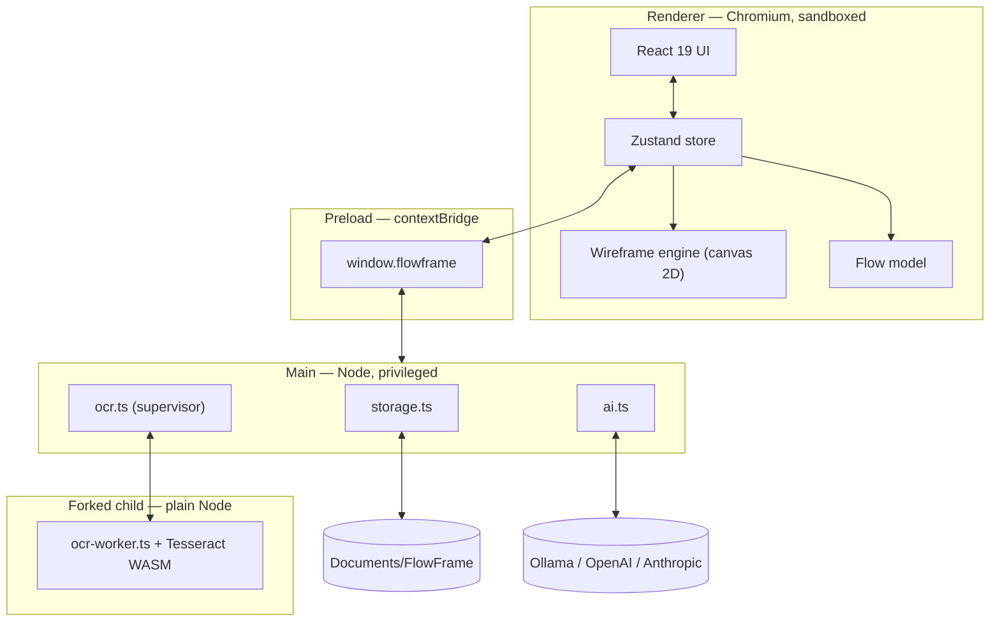
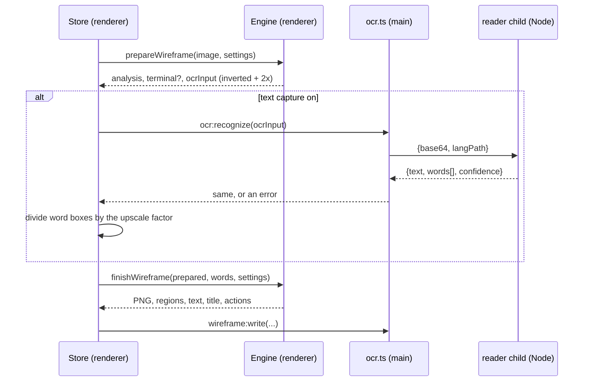

# FlowFrame architecture

Written for whoever — or whatever — picks this codebase up next. It explains not
just what the pieces are, but why each one sits where it does, because several of
those placements are the result of a measurement rather than a preference.

## The shape of the app

FlowFrame is an Electron app with four processes in play.



### Why the split is this way

**The renderer has no privileges at all.** `contextIsolation: true`,
`nodeIntegration: false`, and a Content-Security-Policy with `connect-src 'self'`
— it cannot read a file and cannot open a socket. Everything it needs comes
through the preload bridge as a named, typed function. Two things fall out of
that: API keys never enter the process that renders untrusted image content, and
model calls made from the main process sidestep the CORS wall a packaged
renderer origin would hit on `http://localhost:11434`.

**The wireframe engine lives in the renderer** because it is a canvas workload.
It needs the GPU-backed 2D context, and keeping it there means image data never
crosses a process boundary just to be drawn.

**Text capture lives in a forked Node child**, and this one is not a taste call.
Tesseract's WebAssembly core was measured in three environments on the same
image:

| Environment | Time to read one 992×1200 screen |
| --- | --- |
| Plain Node 22 | 1.1 s |
| Electron, `ELECTRON_RUN_AS_NODE=1` | 1.1 s |
| **Electron main process** | **minutes — 38% complete after 2.5 min** |

So `src/main/ocr.ts` forks `src/main/ocr-worker.js` with
`ELECTRON_RUN_AS_NODE=1` and `execPath: process.execPath`. That is the middle row
of the table, and it is roughly a hundred times faster than doing the same work
in the process that owns the window. Putting it in the renderer instead would
have meant loosening the CSP for `wasm-unsafe-eval` and blob workers; the fork
costs nothing and keeps the policy strict.

## Process responsibilities

| File | Runs in | Responsible for |
| --- | --- | --- |
| `src/main/index.ts` | main | The window, every IPC handler, native dialogs |
| `src/main/storage.ts` | main | The on-disk format, atomic writes, path-escape safety |
| `src/main/ai.ts` | main | Provider routing, streaming, key encryption via `safeStorage` |
| `src/main/ocr.ts` | main | Supervises the reader child: lifecycle, timeouts, errors |
| `src/main/ocr-worker.ts` | forked Node | Tesseract itself; keeps one engine warm across a batch |
| `src/preload/index.ts` | preload | The entire surface the renderer is allowed to touch |
| `src/renderer/src/lib/wireframe.ts` | renderer | The engine — analyse, segment, classify, draw |
| `src/renderer/src/lib/flow.ts` | renderer | Flow drafting, reachability, Mermaid and Markdown export |
| `src/renderer/src/state/store.ts` | renderer | One project in memory, autosave, the generation loop |
| `src/shared/types.ts` | both | The contract; changing it changes both sides at once |

## The generation loop

Generation is deliberately two-phase, because text capture has to happen in the
middle: the classifier reads the words to tell a button from a photograph.



Failure of the reader is never fatal. A timeout, a crashed child or a missing
language file all degrade to "no words", and the wireframe is still drawn from
the pixels alone.

## Invariants worth preserving

1. **The renderer stays unprivileged.** Any new capability is a named method on
   the preload bridge, never a loosened CSP or `nodeIntegration`.
2. **Text capture is optional.** Every downstream consumer — classification,
   drawing, the flow model, the spec export — must work when `words` is empty.
   The `Read text` toggle exercises exactly this path, and a test covers it.
3. **The on-disk format is the source of truth.** Nothing may live only in
   memory. The "survives a reopen" test exists to enforce that.
4. **Writes are atomic.** `storage.ts` writes to a temp file and renames. Never
   write a project file directly.
5. **Paths are checked.** `safeJoin` refuses anything that escapes the project
   folder. All asset paths come from the renderer, so they are untrusted input.
6. **One reader child per batch.** Starting Tesseract costs far more than reading
   a page. The child is shut down when a run finishes, not between screens.

## Where the data lives

```
<Documents>/FlowFrame/
├── settings.json                 provider and model choices
├── keys.json                     API keys, encrypted with the OS keychain
└── projects/<projectId>/
    ├── project.json              modules, screens, regions, captured text, flow, chat
    ├── assets/<moduleId>/        the screenshots, copied in
    └── wireframes/<moduleId>/    the generated PNGs
```

The module folders are not cosmetic: moving a screen between modules in the app
moves its files on disk, so the tree always matches what the UI shows.

## Testing strategy

Everything is an end-to-end test driving the real Electron app through Playwright
— there are no unit tests, because almost every interesting behaviour here is a
collaboration between processes.

| Suite | Covers | Needs |
| --- | --- | --- |
| `tests/flow.spec.ts` | The whole journey: modules, generation, preview, flow, paste, rearrange, export, reopen | Nothing |
| `tests/terminal.spec.ts` | Mainframe detection, text capture, F-keys, table merging, capture-off fallback | Nothing |
| `tests/ollama.spec.ts` | A live local model, including a vision question | Ollama running; skips itself otherwise |
| `tests/screenshot.spec.ts` | Regenerates the README images | Nothing |
| `tests/make-fixtures.mjs`, `tests/make-terminal-fixture.spec.ts` | Build the fixtures | Nothing |

Fixtures are generated, never checked in as photographs: raw PNGs written by hand
for the graphical screens, and canvas-rendered terminal screens for the green
ones. That keeps CI free of any browser download or native image library.

Assertions on captured text are always fuzzy. Recognition turns `Userid` into
`Usexrid` and `0091883` into `0891883` often enough that exact matching would
make the suite flaky for no benefit. Assert on high-confidence words and on
structure instead.
