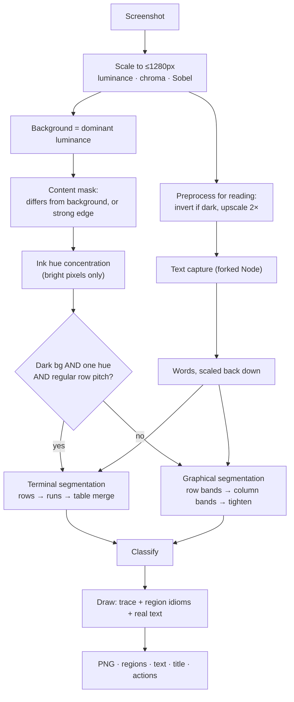

# The wireframe engine

`src/renderer/src/lib/wireframe.ts`. A screenshot goes in; a traced wireframe,
a list of classified regions, the words on the screen and the actions it offers
come out. Everything runs on-device in a canvas — **no model is involved in
turning a screenshot into a wireframe.**

## The two families of screen

The engine branches early, because graphical and terminal screens break each
other's assumptions.

| | Graphical | Terminal (3270 / 5250) |
| --- | --- | --- |
| Background | Light, usually near-white | Dark, near-black |
| Ink | Many colours | One phosphor colour: green, amber or white |
| Layout | Free-form boxes | A fixed character grid, 80 or 132 columns |
| Imagery | Photos, icons, illustrations | None |
| Controls | Buttons, fields, cards | Labels with dot leaders, entry fields, PF keys |

Run the graphical path over a green screen and you get nonsense — the original
version of this engine reported *ten buttons* on a CICS signon screen that has
none, because bright green text scores high on the "colourful, therefore an
image" test and every underlined field looks like a control.

## Pipeline



## Step 1 — analyse

Three maps are built over the scaled image: luminance, per-pixel colour spread
(chroma), and Sobel edge magnitude.

The **background** is the luminance that occurs most often. The **content mask**
marks every pixel that differs from that background by more than 14 levels, or
carries strong colour, or sits on a strong edge.

The mask — not the edge map — is what layout is found from. This matters: a solid
button or a filled header bar has ink through its whole body, while its Sobel
response is only a hairline around the rim. An earlier version segmented on edges
and produced a screen full of thin strips where the solid blocks were.

## Step 2 — is this a terminal?

Three conditions, all required:

1. `background < 96` — the screen is dark.
2. `inkHueConcentration >= 0.72` — at least 72% of the **bright** ink falls in a
   single 30° hue bucket (or the "too grey to have a hue" bucket, for white-on-
   black screens).
3. A regular row pitch — at least six text rows, where 70% of the gaps between
   row starts are near-integer multiples of the smallest gap. Blank lines make
   some gaps a multiple of the pitch, which is why multiples are accepted rather
   than requiring equal gaps.

Only bright pixels count toward the hue measure. The first version averaged over
all ink and scored a pure green screen at 0.497 — the dim, antialiased halo
around each glyph has an unstable hue and drowned out the signal entirely.

The column count is then snapped to 80 or 132, the only two geometries that
exist on real hardware, and the cell width follows from the image width.

## Step 3 — segmentation

**Graphical.** A horizontal projection of the mask splits the screen into bands
separated by whitespace; each band is split into columns the same way; each box
is shrunk until its sides touch content. The gap that counts as a separator is
`max(8, height × 0.022)` — deliberately larger than a line gap, so a paragraph
stays one region instead of becoming one region per line.

**Terminal.** Rows come from the same projection with a much tighter gap
(`rowPitch × 0.35`). Each row is then split into runs wherever three or more
blank cells appear — which is how 3270 separates one field from the next. Three
cells rather than two: dot leaders and column padding routinely leave two, and
splitting there cuts `Userid . . . . . :` into pieces.

Finally, consecutive rows whose runs line up in the same columns are merged into
a single `table` region. Without this, a twenty-row subfile becomes sixty
regions and the wireframe is unreadable.

## Step 4 — classification

Graphical, in order — position first, then words, then shape:

| Result | Test |
| --- | --- |
| `header` / `footer` | Full-width bar pinned to the top or bottom |
| `button` | Reads like a control label: a short verb phrase, ≤4 words, no sentence punctuation |
| `label` | Text ending in a colon, under 40 characters |
| `image` / `hero` | Colourful and filled — **unless** it is control-shaped |
| `nav` | Very thin full-width bar at an edge |
| `button` / `input` | Short and control-shaped: filled reads as a button, hollow as a field |
| `list` / `text` | Four or more ink lines, or two |
| `card` / `block` | Whatever is left |

The "unless it is control-shaped" clause exists because a brand-coloured button
is exactly as saturated as a photograph. Only its aspect ratio and its label tell
them apart, and the label is the stronger signal — which is why classification
runs *after* text capture, not before.

Terminal, driven almost entirely by the words:

| Result | Test |
| --- | --- |
| `fkeys` | Contains `F3=` or `PF3=` |
| `field` | All underscores and dots, or starts with `===>` |
| `message` | Starts with a message id like `DFHCE3520` |
| `label` | Ends in `:` or a dot-leader run |
| `title` | On the top row |
| `text` | Everything else |

**Entry fields are found from ink thickness, before anything else.** For each row,
a column whose ink is at most a third of the row's height and ends near the
baseline is an underscore column — a rule, not a glyph. Contiguous runs of those
columns are fields, and their span is cut out of any text run that overlaps them.

Thickness rather than position: an earlier version tested where the ink *started*
and used a fraction of the row height as the cutoff. That threshold landed within
two pixels of the answer, so it worked on macOS and failed on Linux. How much ink
a column holds is a far larger margin — four pixels for a rule against eleven for
a letter, measured on the fixtures here.

Runs of those columns are then assembled **bridging gaps of up to about a third
of a cell**. Each underscore is drawn per character cell and the cells do not
quite touch, so a field of eight underscores is eight runs of eleven pixels
rather than one run of ninety, and every one of them falls under any sensible
minimum width. Without the bridging, no field is ever found.

This is deliberately not done by splitting on blank cells. A 3270 leaves only two
blank cells between a label and its field, which is narrower than the gap needed
to keep `Userid . . . . . :` in one piece — so whether a label and its field
merged came down to font metrics, and differed between macOS, Linux and Windows.
Reading the ink instead makes it a property of the screen rather than of the
machine. Recognition renders those same underscores as dashes on one platform,
dots on another and nothing at all on a third, which is why the words are not
consulted for this at all.

With text capture off entirely, the terminal path falls back to shape and
position alone, and entry fields are still found.

## Step 5 — drawing

The Sobel trace is laid down first, faint, as the pencil under the drawing —
except on terminal screens, where the trace is all glyph edges and would smear
the text the regions are about to draw properly.

Each region is then drawn in its own idiom: rounded rectangles for buttons,
crossboxes for images, an underline for a terminal entry field, a ruled box for a
table. Where words were captured they are drawn for real; where they were not,
text regions fall back to ruled placeholder lines.

## Text capture

Reading is optional, controlled by the **Read text** toggle, and every consumer
downstream must work without it.

Preprocessing happens in the renderer, where there is a canvas: dark screens are
inverted (recognition is markedly better on dark text over a light ground) and
everything is upscaled 2×.

**A light page carrying dark blocks is read twice.** A solid header bar or a
brand-coloured button is light text on a dark ground — locally inverted relative
to the page — and a reader tuned for the page as a whole misses those words
entirely. When more than about 0.4% of the screen is markedly darker than the
page, a second inverted pass runs and the two readings are merged, keeping
whichever read the same spot more confidently. Screens without such blocks, and
terminal screens, still cost a single pass.

This was not a theoretical concern: a blue "Create account" button's label is
read on macOS and Linux and missed on Windows.

**Known limitation.** The second pass did not close that gap entirely. Short
labels on filled controls remain the least reliable thing to capture, and how
reliably they come back varies with the renderer's antialiasing. Body text,
field labels and terminal screens are captured consistently on all three
platforms; a button's own label may or may not be, so nothing downstream should
depend on it being present. Region classification already treats a missing label
as "no opinion" and falls back to shape. Word boxes come back in upscaled coordinates and are
divided by the same factor, so they land in region coordinates with no second
mapping. Words below 40% confidence are dropped.

Words are assigned to whichever region contains their centre, then grouped into
lines by **vertical centre** — not by top edge. Dot leaders, colons and commas
sit lower and are shorter than letters, and comparing tops splits
`Userid . . . . . :` into two lines.

Recognition is never exact. `Userid` becomes `Usexrid`, `0091883` becomes
`0891883`. Anything built on captured text — and any test asserting on it — has
to tolerate that.

## Step 6 — naming the screen and its fields

Two passes over the finished region list, both after classification, because
both need the kinds and the words. Neither can fail: with the words turned off
they degrade to something honest rather than to nothing.

### The screen's name

`findTitle` tries three things in order. The first is the original rule: the
wordiest `header` region on a graphical screen, the wordiest `title` region on a
terminal one. Plenty of screens put their heading in plain text rather than in a
bar, though, and that rule then returns nothing at all — so the second is the
wordiest heading-shaped line in the **top 30%** of the canvas, and the third is
the wordiest heading-shaped line anywhere. "Heading-shaped" means 3–60
characters with real letters in it and not an action word, so a button never
becomes a screen name.

If all three come back empty, `titleFor` falls back to the prettified file name,
which is why a screen always has a name even when nothing was read off it. A
name the user typed themselves beats every one of these.

### Pairing a label with its field

`pairFields` walks every control — `field` on a terminal screen, `input` on a
graphical one — and looks for the label that names it:

| Rule | Where it applies | Test |
| --- | --- | --- |
| **Left** | Terminal, and half of every web form | Same row band, label's right edge within the budget of the control's left edge. Vertical **centres**, not top edges — a colon and a dot leader sit lower than the letters |
| **Above** | Most modern forms | Horizontal spans overlap by ≥ 40%, label's bottom within `1.2 ×` the control's height above its top |
| **The control's own words** | Where segmentation merged them | A label and its box sit closer together than two sections do, so they often arrive as one region. Then the region's own text *is* the label |
| **Position** | Nothing found | `Field 1`, `Field 2` in reading order, tagged `from: 'position'` so the interface can show it as unnamed rather than as a bad guess |

The row band is measured differently on each family, and that matters: a
terminal entry field is a rule four pixels tall, so its own height is useless as
a yardstick for "the same row" — the label beside it is three times taller. The
row pitch is the honest measure there, the control's own height on a graphical
screen.

One filter: a control whose text is nothing but dots is dropped. The thickness
test that finds entry fields cannot tell a dot leader from an underscore rule —
both are thin, both sit on the baseline — so a label row sometimes arrives here
as a field. It is filtered *here* rather than in the detection, which is tuned
within two pixels of the answer.

## Header and footer scope

`includeHeader` and `includeFooter` decide whether the two bands appear. The
region is **always kept** on the wireframe and filtered at each point that
consumes it, so flipping the toggle costs nothing anywhere — no re-reading, no
re-segmenting — except the drawn PNG, which is baked at generation time and
catches up on the next redraw.

`findTitle`, `extractActions` and `pairFields` deliberately ignore the setting
and read every region. Excluding the header is a choice about what is *shown*,
not a pretence that the pixels are absent; otherwise hiding a header would erase
the screen's own name.

## What comes out

```ts
interface WireframeResult {
  dataUrl: string        // the PNG
  regions: Region[]      // each with kind, box, and captured text
  terminal: boolean      // which family this screen was read as
  text: string           // everything read, in reading order
  title: string          // the screen's own name
  actions: ScreenAction[] // PF keys, or button labels, each ranked
  fields: NamedField[]    // entry controls, with the labels that name them
}
```

`actions` is what makes the flow draft specific. A terminal screen offering
`F6=Create` produces the transition *"Presses F6 (Create)"* rather than
*"Continues"*, and `title` is used to name the flow node — so the canvas reads
`CUSTOMER ACCOUNT INQUIRY` instead of `11-customer-inquiry`. Each action carries
a `rank`: 0 for a verb that moves the user on, 2 for `exit`, `cancel` and
`back`, 1 for everything else. The flow picks the lowest rank, so a screen whose
first button is *Cancel* is not described by it.

Everything here is **derived** and is rebuilt from scratch on every run. The
names the user types live on `ScreenAsset` instead, and are applied over the top
by `screenFields` and `screenName` — which is what lets a rename survive a
redraw.

## Tuning knobs

| Setting | Effect |
| --- | --- |
| `fidelity` | How strongly the traced edges show through |
| `threshold` | Edge threshold for the trace and for edge statistics |
| `showRegions` | Draw the inferred boxes at all |
| `labelRegions` | Tag each box with its kind |
| `crossboxes` | The × through image placeholders |
| `blueprint` | Invert to light-on-dark output |
| `readText` | Capture the words |
| `includeHeader` | Show the header band. Overridable per screen |
| `includeFooter` | Show the footer band. Overridable per screen |

Note that `threshold` no longer affects segmentation — that moved to the content
mask, which is deliberately not user-tunable because the background estimate
makes it self-adjusting.
